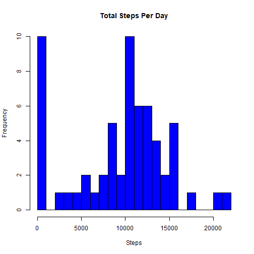
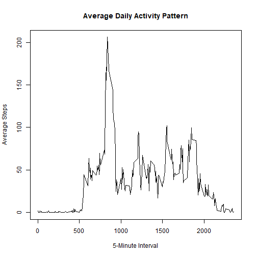
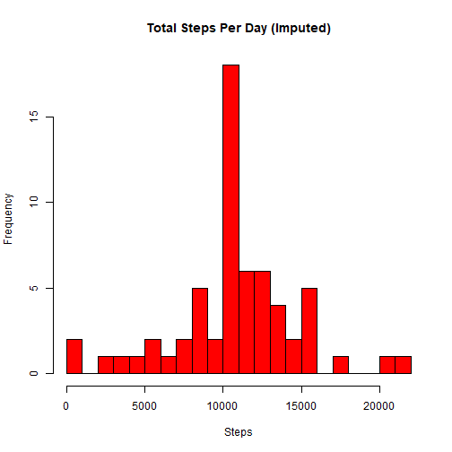
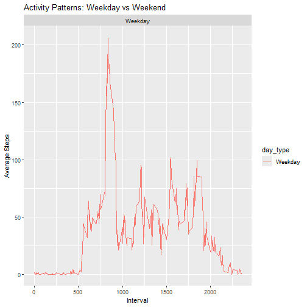

## Introduction
This report analyzes data from a personal activity monitoring device, collected over two months (October-November 2012). The dataset contains the number of steps taken every 5 minutes throughout the day.

## Loading and Preprocessing the Data


``` r
# Load necessary libraries
library(tidyverse)

setwd("C:\\Users\\user\\Downloads\\repdata_data_activity")
# Read the dataset
data <- read.csv("activity.csv")

# Convert date to Date format
data$date <- as.Date(data$date, format="%Y-%m-%d")
```

## Total Number of Steps Taken per Day


``` r
# Calculate total steps per day
total_steps_per_day <- data %>% group_by(date) %>% summarise(total_steps = sum(steps, na.rm = TRUE))

# Histogram
hist(total_steps_per_day$total_steps, main="Total Steps Per Day", xlab="Steps", col="blue", breaks=20)
```



``` r
# Mean and Median
mean_steps <- mean(total_steps_per_day$total_steps, na.rm = TRUE)
median_steps <- median(total_steps_per_day$total_steps, na.rm = TRUE)
mean_steps; median_steps
```

```
## [1] 9354.23
```

```
## [1] 10395
```

## Average Daily Activity Pattern


``` r
# Compute average steps per interval
average_steps_interval <- data %>% 
  group_by(interval) %>% 
  summarise(avg_steps = mean(steps, na.rm = TRUE))

# Time series plot
plot(average_steps_interval$interval, average_steps_interval$avg_steps, type="l", 
     xlab="5-Minute Interval", ylab="Average Steps", main="Average Daily Activity Pattern")
```



``` r
# Interval with max steps
max_interval <- average_steps_interval[which.max(average_steps_interval$avg_steps),]
max_interval
```

```
## # A tibble: 1 × 2
##   interval avg_steps
##      <int>     <dbl>
## 1      835      206.
```

## Imputing Missing Values


``` r
# Count missing values
missing_values <- sum(is.na(data$steps))
missing_values
```

```
## [1] 2304
```

``` r
# Impute missing values using mean for that interval
data_imputed <- data
for (i in 1:nrow(data_imputed)) {
  if (is.na(data_imputed$steps[i])) {
    interval_mean <- average_steps_interval$avg_steps[average_steps_interval$interval == data_imputed$interval[i]]
    data_imputed$steps[i] <- interval_mean
  }
}

# Recalculate total steps per day after imputation
total_steps_imputed <- data_imputed %>% group_by(date) %>% summarise(total_steps = sum(steps))

# Histogram
hist(total_steps_imputed$total_steps, main="Total Steps Per Day (Imputed)", xlab="Steps", col="red", breaks=20)
```



``` r
# Mean and Median after imputation
mean_steps_imputed <- mean(total_steps_imputed$total_steps)
median_steps_imputed <- median(total_steps_imputed$total_steps)
mean_steps_imputed; median_steps_imputed
```

```
## [1] 10766.19
```

```
## [1] 10766.19
```

## Weekday vs Weekend Activity Patterns


``` r
# Create weekday/weekend variable
data_imputed$day_type <- ifelse(weekdays(data_imputed$date) %in% c("Saturday", "Sunday"), "Weekend", "Weekday")

# Compute average steps per interval by day type
steps_by_day_type <- data_imputed %>% 
  group_by(interval, day_type) %>% 
  summarise(avg_steps = mean(steps))
```

```
## `summarise()` has grouped output by 'interval'. You can override using the `.groups` argument.
```

``` r
# Panel plot
library(ggplot2)
ggplot(steps_by_day_type, aes(x = interval, y = avg_steps, color = day_type)) +
  geom_line() +
  facet_wrap(~day_type, ncol = 1) +
  labs(title = "Activity Patterns: Weekday vs Weekend", x = "Interval", y = "Average Steps")
```



## Conclusion
This report analyzed personal activity monitoring data by examining daily and interval-based step patterns. We also handled missing values using interval-wise averages and compared activity patterns on weekdays vs. weekends. The results show distinct differences in step activity over time.
